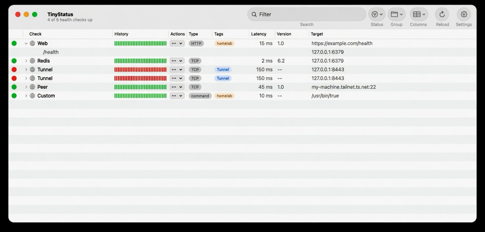
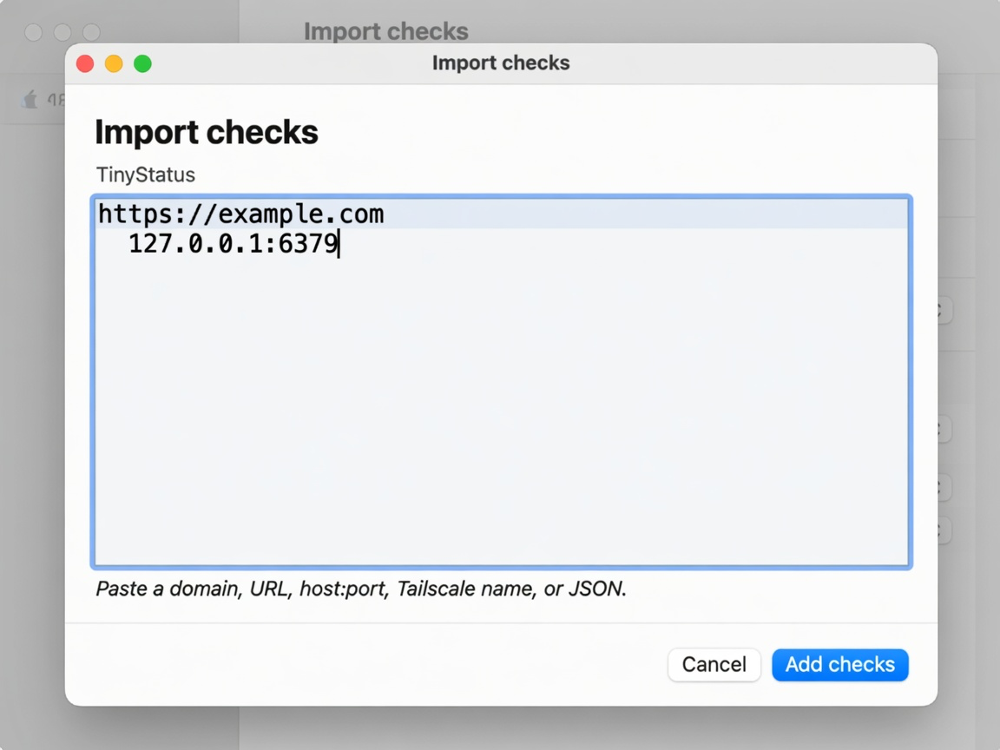

# Usage

Requires **macOS 26+**. Build with Xcode Command Line Tools (`swiftc` + AppKit).

## Install and run

```bash
git clone https://github.com/duyet/tiny-status.git
cd tiny-status
make run
```

| Command | Result |
|---------|--------|
| `make app` | Builds `TinyStatus.app` |
| `make run` | Builds and opens it |
| `make cli` | Builds; prints how to run `scripts/tiny-status` |
| `make test` | Compiles `Tests/Run.swift` with the library sources |

Optional: `ln -sf "$(pwd)/scripts/tiny-status" ~/.local/bin/tiny-status`.

Releases: conventional commits on `main` open a **release-please** PR that bumps **0.1.x**, `CHANGELOG.md`, and `Info.plist`. Merge that PR by hand. Never `--auto`. GitHub Actions also attach `TinyStatus-<tag>.zip` when a tag is created.

## First launch

If `~/.config/tiny-status/tunnels.json` is missing, the app writes a small starter file (generic `example.com` / `127.0.0.1`). Copy richer samples from [`tunnels.example.json`](../tunnels.example.json) or [`checks.example.json`](../checks.example.json).

## Window



The main window has three panes (`NSSplitViewController`): **sidebar · list · inspector**.

- **Sidebar:** All checks, Needs attention (down or degraded; red when non-zero), **Kinds** (HTTP, TCP, Tunnels, Commands) and **Tags**, each with a count. Selecting a row filters the list. A TCP check with a `start` action counts as a tunnel. Right-click **Tunnels** → New Tunnel…. The sidebar footer shows network and Tailscale status.
- **List:** the outline table described below.
- **Inspector** (`⌥⌘I` or the toolbar button): shows the selected check. You get a status line with its duration (`DOWN · 4m`), the title, the target and kind, the primary action and **Check now**. It also shows the last error in red monospace, uptime over retained history, median latency, the process (TCP) and the version (HTTP). With nothing selected it shows a placeholder.

A thin progress bar under the toolbar tracks each poll. It is indeterminate until the first result comes in, then fills as checks finish and fades out.

Columns: status, Check, Actions, Type, Tags, Group, History, Latency, Version, Target.

- **Sort:** click a column header. Empty sort uses config `order[]` / file order. There is no sort toolbar.
- **Filter:** toolbar search (name, tag, type, target, status, group, version) plus Status menu All / Up / Degraded / Down.
- **Group:** toolbar Group = Tag / Kind / None. Drag group headers to reorder (`groups[]`). Drag rows to reorder (`order[]`).
- **Density:** Settings → General. Default **relaxed** (`regular`). Compact is `compact`. Not on the toolbar.
- **Hidden columns:** Columns menu. Group is hidden by default.
- Click a row to expand details (listen/process for TCP; nested JSON services and versions for HTTP).
- Double-click opens `openUrl` or the health URL.
- Right-click: Enable / Disable, then visible actions.
- Status glyph pulses while **Checking** or **Starting**, then scales in on Up / Down / Degraded. Animations are skipped when *Reduce motion* is on.
- History is Uptime-Kuma-style ticks (last 40 polls).

Empty table: “No checks yet. Choose TinyStatus → Import checks…”.

Window subtitle: `N of M health checks up · Checked …`.

Sidebar footer: **network** (Wi-Fi / Ethernet / Offline) and **Tailscale** (up + machine name, stopped, needs login, or not installed). Tailscale is read from the local `tailscale` CLI (`status --json`). No IPs are shown.

### Tunnels

A tunnel is a TCP check with a `start` action. Start runs the argv, which is often long-lived, such as `ssh -N`. The app then tries to connect to the local port with backoff, up to 10 attempts. The state moves through:

| State | Shown as |
|-------|----------|
| Stopped | `Stopped` |
| Starting | `Starting · waiting for port 2222 (attempt 2/10)` |
| Connected | `Connected · up 2h 14m` |
| Failed | `Failed · exit 255: <stderr tail>` |

The list's Target column adds the state text. In the inspector, a switch sets intent (start / stop) and the status dot shows the result. When a tunnel fails, the inspector offers **Retry** and **Show log**.

**New Tunnel…** (`⇧⌘N`, or right-click Tunnels in the sidebar) asks for Name, Local port, Remote host:port and Via (ssh host). It adds a check to `checks[]` with start argv `["/usr/bin/ssh","-N","-L","<lport>:<rhost>:<rport>","<via>"]` and a TCP probe on `127.0.0.1:<lport>`.

### Toolbar

Toggle sidebar · Search · Status · Group · Columns · Reload · Settings · Toggle inspector.

### App menu

- **TinyStatus:** About, Settings… (`⌘,`), Import checks… (`⌘I`), Quit (`⌘Q`).
- **View:** Reload (`⌘R`), Toggle Sidebar (`⌃⌘S`), Toggle Inspector (`⌥⌘I`), Columns, Filter Status, Group By.
- **Window:** TinyStatus (`⌘0`).

## Import



**TinyStatus → Import checks…** (`⌘I`) or menu bar **Import checks…**. Paste and **Add checks**.

| Paste | Inferred |
|-------|----------|
| `https://example.com/health` | `http` |
| `https://example.com` | `http` origin, then discover `/health`…, root, or TCP 443/80 |
| `example.com` | HTTP discover; extra TCP `:443` is dropped if HTTP is kept |
| `127.0.0.1:6379` | `tcp` |
| `[::1]:6379` | `tcp` |
| IPv4 / IPv6 alone | TCP 443 and 80 (Tailscale-looking `100.*` uses 22 and 443) |
| `my-machine.tailnet.ts.net` | hostname → HTTP + TCP 443 (TCP twin skipped if HTTP kept) |
| JSON object / array / `checks[]` | mapped to http / tcp / command |
| `{ "command": ["/usr/bin/true"] }` | `command` |

Resolved `url` / `kind` / `host` / `port` are written into the live file. Duplicate ids are skipped.

## Menu bar

- Status item: a dot plus `up/total`. The dot is red if any check is down.
- Click: a popover lists checks with down ones first, highlighted, each with its primary action. Other checks show latency. At the bottom are **Check all** (`⌘R`) and **Open window**.
- Settings → General → **Show in menu bar** (on by default) hides or shows it.

HTTP checks without `image` show the site favicon from `~/.config/tiny-status/favicons/`.

## Settings

Sidebar: **General · Checks · Alerts · Backup · JSON**. **Save** writes `tunnels.json`.

**General** — live counts, last poll, poll interval, density, config path, Reveal in Finder.

**Checks** — list + inspector: Enabled, Alert when failed, identity, endpoint, discover paths, actions, optional k8s argv, last probe.

**Alerts** — master switch; fail / recover / version drift; cooldown seconds.

**Backup** — git copy of the live file. Backup / Pull / Sync. On conflict: Keep local or Keep remote. Uses your machine’s git remotes. Do not commit secrets.

**JSON** — raw editor. Invalid JSON shows an error. Save also writes poll / alerts / backup / density / groupBy from the other pages.

## Notifications

macOS User Notifications on fail, recover, and (if enabled) deploy vs pod version drift. First unknown state does not alert. Cooldown default 300 seconds. Per-check `"alert": false` mutes that row.

## CLI

See [cli.md](cli.md). Config schema: [config.md](config.md).
